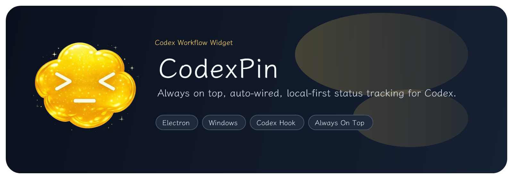

<p align="center">
  
</p>

<p align="center">
  <strong>English</strong> | <a href="./README.zh-CN.md">简体中文</a>
</p>

<p align="center">
  
  
  
  
  
  
  
  
</p>

<p align="center">
  CodexPin is a lightweight always-on-top desktop widget for Codex. It keeps the current task visible while you work in other windows.
</p>

## Overview

CodexPin is built for local Codex workflows on Windows. The packaged app auto-configures a Codex `notify` hook on first launch, listens for local hook events, and reads Codex rollout logs to show the newest live segment from the current session.

Key points:

- Packaged app auto-installs and chains the Codex `notify` hook
- Floating widget stays on top and can be dragged around
- Center panel shows only the latest live segment instead of dumping full logs
- Local 5h and weekly remaining percentages are shown when Codex exposes them locally
- Plays a short completion ping when a working session returns to idle
- Local-first architecture with no Confirmo dependency

## What The Widget Shows

- Top-left: elapsed time for the current Codex turn
- Top-right: current state
  - `Not Connected`
  - `Idle`
  - `Working`
- Center: the latest live segment
  - one `phase`
  - up to two short `details`
- Bottom-left / bottom-right: best-effort local rate-limit percentages
  - `5h xx%`
  - `Week xx%`
- Fallback state when Codex is not running:
  - `No Codex process`

Double-clicking the top bar toggles compact mode.

## Install And Use

Recommended path for most users:

1. Download and install `CodexPin Setup.exe`
2. Choose an install directory if you do not want the default one
3. Launch `CodexPin`
4. Let CodexPin auto-configure the local Codex hook
5. Start or resume a Codex session and watch the floating widget update itself

If auto-setup fails:

- the widget shows `Not Connected`
- the center area shows the failure message
- a `Retry Setup` button appears inside the panel

If CodexPin is connected but no Codex process is currently running:

- top-right stays in `Idle`
- center shows `No Codex process`

## How It Works

Primary flow:

`Codex notify -> CodexPin hook -> ~/.codexpin/codex-status/status.json -> Electron widget`

Live refinement:

`~/.codex/sessions/.../rollout-<session>.jsonl -> live segment parser -> current phase/details + rate limits`

Notes:

- Packaged mode follows the latest local Codex session globally
- Source mode is mainly for development and stays scoped to the current working directory
- Existing Codex `notify` commands are preserved and chained through `~/.codexpin/original-notify.json`

## Local Storage

CodexPin stores its own state under:

```text
~/.codexpin/
  original-notify.json
  codex-status/
    status.json
    sessions/
      <sessionId>.json
```

What those files are used for:

- `status.json`
  - summary index consumed by the widget
- `sessions/<sessionId>.json`
  - richer per-session history
- `original-notify.json`
  - backup of the original Codex notify configuration for rollback and chaining

## Development

```bash
npm install
npm start
```

Useful commands:

```bash
npm test
npm run build
npm run setup:hook
npm run uninstall:hook
```

Notes:

- `npm start` launches the Electron widget in source mode
- source mode also tries to wire the current app entry into Codex `notify`
- `npm run build` creates the Windows installer and unpacked app

## Main Files

- `scripts/codexpin-cli.js`
  - manual setup / uninstall CLI
- `scripts/codexpin-codex-hook.js`
  - source-mode Codex hook entry
- `electron/hookRuntime.js`
  - packaged `CodexPin.exe --codex-hook` entry
- `electron/installBootstrap.js`
  - auto-install bootstrap on app launch
- `scripts/codexpinHookLib.js`
  - hook-side status writing and summary logic
- `electron/codexpinStatus.js`
  - widget-side session selection and state computation
- `electron/codexRolloutLive.js`
  - live rollout parsing for segments and rate limits

## More Docs

- [`docs/codexpin-hook-design.md`](./docs/codexpin-hook-design.md)
- [`docs/codexpin-state-schema.md`](./docs/codexpin-state-schema.md)
- [`docs/tests-checklist.md`](./docs/tests-checklist.md)
- [`docs/solution.md`](./docs/solution.md)
